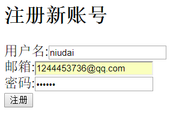
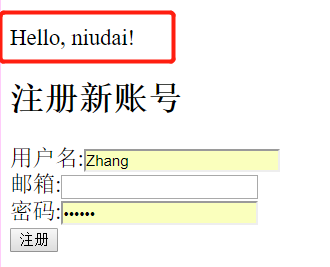

>Spring MVC 3.1 版本增添了`Flash Attribute`的新特性，解决了一直以来关于POST请求后跳转页面导致原有用户传入的数据无法续存的问题。

讲解这个知识点前， 先要理解浏览器的所谓“刷新”的本质是什么。

浏览器刷新的本质是将你上一次发送的HTTP请求重新发送一次。

比如你现在在url地址栏中输入一个网址，打开了这个网址对应的页面，按下了`F5`，浏览器会重新发送一次你的url指定的HTTP请求，但是这种刷新方式也引来了一定的问题。

我之前的一篇文章，[Spring Boot+Mysql构建一个简单的登陆系统](https://zhuanlan.zhihu.com/p/55796334)中, 就遇到了这个问题。

这个例子很简单，就是注册账号（POST请求，将用户名、密码、邮箱存到数据库中），登陆账号。

如图所示：


那么如果我现在在`注册新账号`底下填写了必要信息, 点击了`注册`之后, 我会向服务器发送一个`POST`请求, 这个`POST`请求即包含了`url`, 又包含了我们传入了`表单信息`, 那么如果我现在点击刷新, 刚才的`POST`请求会再次进行一遍，也就是重新注册一次账号，如果`Controller`的方法里没有要求邮箱不可重复的话，数据库中就会存储上两个一模一样的账号信息，比如我现在注册一个新账号：



点击了注册后, 我刷新一下页面, 再返回, 我会发现数据库中有两组相同的数据:


如何避免这种现象呢?

那就是使用`Redirect`方法，让用户提交了表单数据后，返回一个`Redirect`回应, 强制让用户侧自动进行一次`Get`请求, 这样当用户再次刷新的时候, 就不会重新提交一次表单数据了, 所以我们只需再`Controller`方法中增加跳转功能:

```
@PostMapping(path = "/add")
public String addNewUser (@RequestParam String name
                , @RequestParam String email, @RequestParam String password, User user) {
    user.setName(name);
    user.setEmail(email);
    user.setPassword(password);
    userRepository.save(user);
    log.info(user.toString()+" saved to the repo");
    return "redirect:/";
}
```
我将返回值改成了`redirect:/`, 也就是当用户提交了表单信息后, 该方法会返回一个`redirect:/`的`response`, 强制让用户进行跳转, 跳转到入口界面, 也就是根目录的位置, 用一个图来解释这个原理:


当用户填写了表单, 提交了数据, 服务端将数据存在数据空中, 然后发送了让用户跳转的指令, 然后用户自动用`GET`方法跳转到另一个页面, 这样当用户刷新的时候, 就会重新发送`GET`方法, 而不是之前的`POST`。

但是这样一来又出来一个问题, 就是我无法直接将用户提交的表单数据显示在跳转后的页面, 比如我想在用户登陆后, 在跳转后的页面标题上显示`Hello, 用户名`, 但是因为Spring MVC的M层仅仅是对当前的请求有效, 你将用户名的信息存在Model里, 然后再跳转, 跳转后的那个`Controller`方法是不会得到你上一个Model里的信息的, 这就是为什么我们要引入`Flash Attribute`。

`Flash Attribute`里保存的信息会传入下一个跳转页面的`Model`里,或者这么说: 对于一个`Controller`层的映射方法来说, 它目前储存的`Flash Attribute`是来自于上一个页面, 也就是由其跳转来的页面, 而在当前方法中储存的`Flash Attribute`会传入下一个即将跳转过去的页面里，有了它，我们便解决了这个问题。

看这个图：


`FlashMap`是用来以`Key-Value`形式储存`Flash Attribute`的API, 而`FlashMapManager`则是用来储存, 获取, 管理`FlashMap`实例的API。

对于刚才列出的`Controller`代码,我们再做如下改动:

```
@PostMapping(path = "/add") // Map ONLY GET REQUESTs.
public String addNewUser (@RequestParam String name
        , @RequestParam String email, @RequestParam String password, User user, RedirectAttributes redirectAttributes) {
    // @ResponseBody means the returned String is a response, not a view name.
    user.setName(name);
    user.setEmail(email);
    user.setPassword(password);
    userRepository.save(user);
    redirectAttributes.addFlashAttribute("username", name);
    log.info(user.toString()+" saved to the repo");
    return "redirect:/";
}
```
在方法传入参数中加一个`RedirectAttributes`, 然后在代码中给`redirectAttributes`增加一个`key="username"`的`FlashAttribute`, `value`为用户在表单数据中填写的用户名。

然后跳转后，我们的主页面便会显示：


