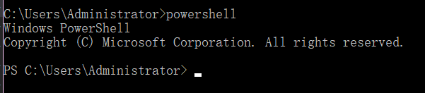
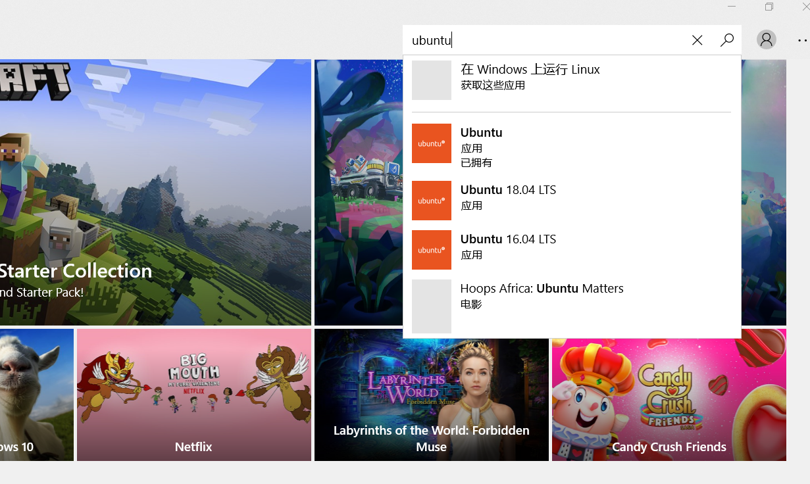
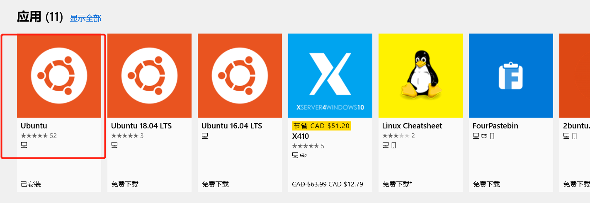
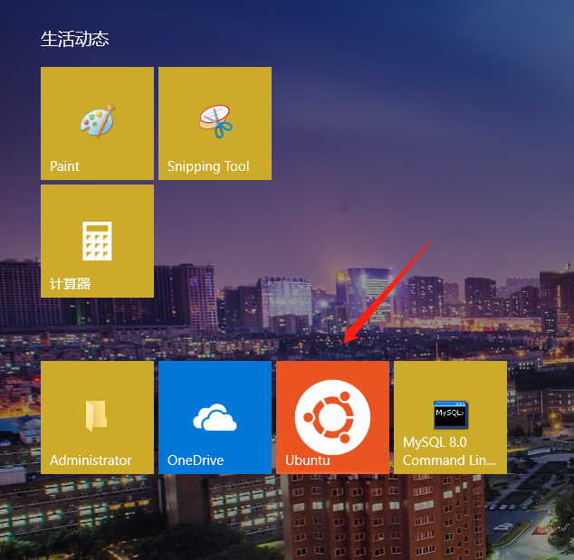
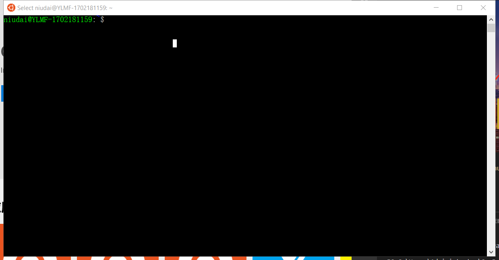
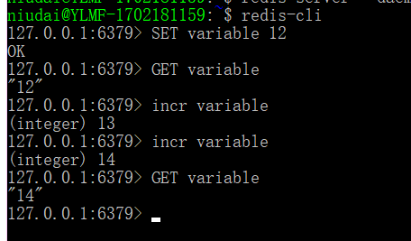

>众所周知，`redis`是没有`windows`平台下的官方支持版本的，这给很多习惯使用`windows`的学习者，开发者带来了不必要的困扰。

虽然很多程序员都推荐在`linux`系统下进行开发，但是据我所知大部分小伙伴们，尤其是还在学习状态的学生们，仍然是在`windows`系统下进行学习，开发的，毕竟在`windows`下还装了很多常用的软件, 有些软件`linux`也不支持，如果直接加上`linux`使用双系统，在短时间内会遇到更多麻烦。

在网上的很多教程中，在`windows`下使用`redis`的方法都是叫你直接下载在`github`上的`ServiceStack`提供的非官方`windows`版本的`redis`,链接在这里:

[Windows平台的非官方版本Redis下载](https://github.com/ServiceStack/redis-windows)

但事实上我并不推荐这种做法, 为什么呢? 

1. 该版本并不是官方支持的, 缺少了官方的技术支持, 在使用上可能会出现更多的问题。
2. 目前`redis`最新版本是`5.0`, 但是目前在非官方的`windows`版本只更新到`3.0`, 落后了两个大版本。

那如果我们既不想更换系统, 也不想使用非官方版本的`redis`, 那要怎么做呢? 

如果你的系统是`windows 10`, 那么好消息来了, 你可以使用`WSL`, 也就是`Windows Subsystem for Linux`, 也就是`windows`下的`linux`子系统来运行`redis`, 事实上, 这也是`windows 10`的一个重要特性。

所以我们分两步: 安装`linux`子系统, 在子系统下安装并运行`Redis`.

## 安装Ubuntu子系统

`Ubuntu`是`linux`的一个重要发行版, 在云服务器, 桌面等领域有非常广泛的应用, 当然你也可以选择别的发行版, 这篇教程我们用`Ubuntu`来示范。

1. `win+R`打开运行面板, 输入`cmd`, 打开命令行工具, 也就是`command prompt`, 在命令行工具内输入`powershell`, 进入`powershell`:



>`powershell`可以认为是`command prompt`的增强版, 内置有基于`.NET`的脚本语言, 功能更多, 可以通过它管理数据集, 注册表, 证书, 文件系统等。

然后我们输入如下语句:

```
Enable-WindowsOptionalFeature -Online -FeatureName Microsoft-Windows-Subsystem-Linux
```

这个语句的意思是打开`linux`子系统的支持, 因为它默认是不支持的, 需要手动打开该支持。

接下来我们需要重启电脑.

重启结束后, 我们就可以下载`linux`子系统了, 有两种方式, 一种是直接在`Windows store`中搜索`ubuntu`, 然后下载安装:


在应用商店的搜索栏搜索`ubuntu`:



选择评论数最多的那个:



下载安装即可。

但是本人是不推荐这种方法的，一个原因就是因为应用商店的这个下载似乎做的不太好，如果中途断网再连上，会出现下载失败等一系列问题，接下来我们介绍第二种方法：

继续像刚才那样打开命令行，进入`powershell`, 输入一个语句就好:

```
Invoke-WebRequest -Uri https://aka.ms/wsl-ubuntu-1604 -OutFile Ubuntu.appx -UseBasicParsing
```
也就是下载的命令, 然后就会自动开始下载, 等下载完毕后, 你的当前目录下就会出现`Ubuntu.appx`的文件,点开它之后,就会自动进行安装, 安装过程中,它会提示你创建一个用户, 类似于`windows`的用户, 你按照提示输入一个用户名, 再输入一个密码, 就可以了, 以后每次使用`sudo`语句的时候, 都要输入密码来验证你的管理员身份。

安装完毕后, 你的开始界面中就会出现一个`Ubuntu`应用:



直接运行, 就会出现我们想要的`linux`环境下的命令行工具:



## 在linux下安装Redis

在`linux`中依次执行如下语句:

```
$ echo deb http://packages.dotdeb.org wheezy all >> dotdeb.org.list
$ echo deb-src http://packages.dotdeb.org wheezy all >> dotdeb.org.list
$ sudo mv dotdeb.org.list /etc/apt/sources.list.d
$ wget -q -O - http://www.dotdeb.org/dotdeb.gpg | sudo apt-key add -
$ sudo apt-get update
$ sudo apt-get install redis-server
$ redis-server --daemonize yes
```

前四个语句是安装我们必要的一些包, 然后更新我们的APT cache后, 就可以安装`redis`了。

随后我们可以直接输入`redis-cli`, 进入`redis`的命令行工具内, 就可以执行一些基本的`redis`数据库操作了:



可以看到`redis`的默认端口是`6379`, 我们用`SET variable 12`来将`12`赋给`variable`这个变量, 然后用`GET variable`获取`variable`的值, 然后再用`incr variable`来让它加一, `incr`就是指代`increment`, "增加"的意思。

`Redis`作为`NoSQL`的一种, 这些数据都是存在内存中的，所以提取地很快。

`redis`的基本命令行工具的使用, 可以参考官方教程。

https://redis.io/topics/data-types-intro

开启了`redis`服务之后, 你就可以在本地的应用中使用`redis`服务了。


