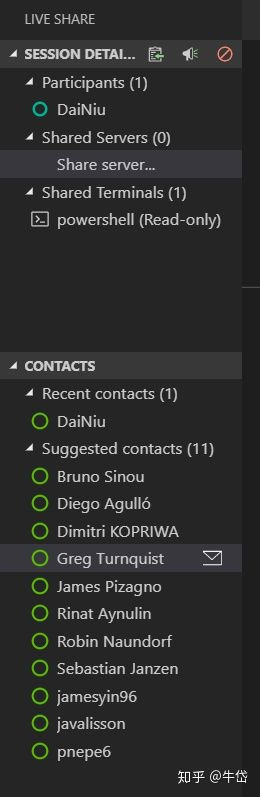

随着2019年的到来，Stack Overflow对2018年的IT生态调查显示：Visual Studio Code超过Visual Studio一跃成为榜首，成为“最受欢迎的开发环境”，没有之一！

VScode的免费，开源，轻量，快速，强大，智能提示已经让它火遍了全球，今天就来让我们来学习一下VScode的八个提升开发效率的小贴士，让你的开发效率up up up！

1. 按下ctrl+K，再按下ctrl+S，查看快捷键列表。

如果你想查看某个操作的快捷键，你并不用去看官方文档，只需要调出快捷键列表，在上方搜索栏搜索你想要的操作，即可获知对应的快捷键组合。

2. 按下ctrl+P，弹出搜索栏，直接输入关键字，在所有文件中搜索特定符号：

`在所有文件内搜索"employee"关键字`

在搜索栏前输入"@"，在当前文件中搜索特定符号：

`在当前打开文件中搜索”employee“关键字`

在搜索栏前输入”&gt;“，搜索所有可使用的命令 比如我想使用spring initializr扩展的命令, 创建一个Maven工程：

`搜索"spring initializr：Generate a Maven Project"命令`

3. 在阅读代码的时候，常常需要在不同的文件间切换，这时会出现“看了这个忘了那个”的现象，我们可以在插件市场中下载Bookmarks插件，助你更快标记、寻找某块代码。
 

运用第二条的知识，ctrl+P，再输入"&gt;"，输入插件名，查看该插件的命令：

`标记图中36-38行代码`

选择命令Toggle Labeled（标记并给该标记命名），为其命名“getId”后，当我们在别的文件中时，我们可以直接搜索该标签，跳转至标记处~

`选择Bookmarks：List from All Files 陈列出你的标签`

看到了我们刚才标记的代码块~Enter键直接跳转~

4. 对某个函数或变量，右键点击，在不移动目前代码位置的前提下，查看其定义和引用。

`右键，点击peek definition`

`弹出该属性的定义`

同理，还可以看这个函数或变量在哪里被引用：选择”peek reference“

`查看变量的引用位置`

`弹出变量的引用位置`

5. 通过`ctrl+=`和`ctrl+-`组合来进行缩放。

当你觉得现在的字体有点小，看不清，或者有点大，你不必去在设置菜单栏里面绕个晕头转向，你只需用如上两个组合键来进行缩放即可。

`放大`

`缩小`

6. 使用Paste Json As Code扩展，将复制黏贴来的json文件直接序列化成代码。

举例：

将如下json文件：

`json文件`

序列化为Java代码：

直接打开命令板，输入Paste Json As Code的命令即可，十分方便。

7. 使用安装量高达一千两百万的Gitlens扩展，助你更好地进行代码合作，查看代码更改历史。

结合GitLens，你从github上clone下来的代码上就会出现代码作者，代码commit的具体时间：

`可以看到作者Greg Turnquist在三件前对改代码做了commit`

点击右上角新出现的“Toggle File Blame Annotation”按钮，对比展示你的代码与原repo的区别：

`点击改图标`

`查看你更改后的与原版本代码的区别`

分割线左侧是原repo，右侧是我们更改后的代码，我们可以看到具体的代码作者和commit时间。

在左侧的action bar中，新出现了GitLens的图标，点击后，详细查看branch，master，commit的信息：

可以看到当前repo的整个commit历史，作者的github头像也能看到，点击某个修改历史，直接就可以看到该修改和修改前代码的所有区别。

8. 压轴出场：微软主打的革命性开发扩展：VS Live Share，在这个扩展的加持下，你可以和你的同事完成真正的远程实时代码协同开发，对方并不需要将整个工程clone下来，只需要连接到你开的session，你和他就可以对一个文件进行开发，修改。

>Visual Studio Live Share enables you to collaboratively edit and debug with others in real time, regardless what [programming languages](http://link.zhihu.com/?target=https%3A//docs.microsoft.com/en-us/visualstudio/liveshare/reference/platform-support%23visual-studio-code) you're using or app types you're building. It allows you to instantly (and [securely](http://link.zhihu.com/?target=https%3A//docs.microsoft.com/en-us/visualstudio/liveshare/reference/security)) share your current project, and then as needed, share [debugging sessions](http://link.zhihu.com/?target=https%3A//docs.microsoft.com/en-us/visualstudio/liveshare/use/vscode%23co-debugging), [terminal instances](http://link.zhihu.com/?target=https%3A//docs.microsoft.com/en-us/visualstudio/liveshare/use/vscode%23share-a-terminal), [localhost web apps](http://link.zhihu.com/?target=https%3A//docs.microsoft.com/en-us/visualstudio/liveshare/use/vscode%23share-a-server), [voice calls](http://link.zhihu.com/?target=https%3A//aka.ms/vsls-audio), and more! Developers that join your sessions recieve all of their editor context from your environment (e.g. language services, debugging), which ensures they can start productively collaborating immediately, without needing to clone any repos or install any SDKs.  
VS live share 让你可以实时与你的合作者协同编辑，调试代码，不管你是在使用何种语言，开发何种应用。它让你可以实时并安全地分享你的当前工程，并且如果需要，甚至可以分享调试会议，命令行示例，本地web应用，语音通话，甚至更多！参加会议的开发者可以从你的环境中接收到所有的编辑内容（比如语言服务，调试），确保参会者可以高效合作，无需克隆项目代码并安装开发包。

使用起来很容易，安装该扩展：

enable该扩展，reload你的VScode，然后看到左下角的Live Share图标：

跳转至浏览器页面:

使用我们的GitHub账号登陆（也可以用微软账号）。

随后回到我们的VS live share界面中，可以看到：

`实时代码沙龙`

只有我一个人，那如何让别人也参与进来呢？

`点击该图标`

每一个举办的实时代码会议，都有一个网址，也就是url地址，点击这个按钮，该地址会自动进入你的剪贴板中，你只需把这个url发送给你的同事，你的同事在浏览器中进入这个网址：

可以看到这个代码实时会议是我开的，然后直接点击自动弹出的Open Live Share for VS Code，你的VScode就会自动启动，打开之后，你已经进入了该代码实时会议，可以和大家开始共享整个工程，甚至可以用voice call和他们实时语音交流，共同享受代码协作开发的乐趣。