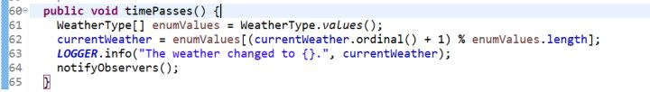

在实际工作中, 我们常常发现, 虽然每个工程或项目都不尽相同, 但是总有那么一些工程看起来很类似, 它们可能被用在了完全不同的领域, 被完全不同的用户群体使用, 但这个工程本身的内在逻辑却十分相似, 比如:

在股市中, 当股价波动的时候, 我们希望每个股民能收到"股价波动"的信息; 在温度测量站中, 当测量站测得的温度发生改变时, 我们希望每个使用了某天气温度APP的都收到温度改变的信息; 你关注了一个微信公众号, 当这个公众号新上传了一篇文章后, 我们希望每个关注了这个公众号的人都能看到这篇文章的推送......

刚刚讲的这三个例子, 你是否发现了共同点 ?

它们都是由一个被观察的对象和多个观察对象组成的体系, 当被观察的对象发生某种状态变化时, 每一个观察对象都应该即时获知这一信息。

对于上面的例子来说，股市或时某支股票就是被观察对象（Observable），而股民们则是“观察者”（Observer），当股票的价格发生波动（被观察对象状态发生改变），每个股民“观察者”将获知这一信息。

当微信公众号（被观察对象）改变状态（新推送了一篇文章），所有关注者（观察者）都将获知这一信息，收到“新推了一篇文章”这一信息。

画一个图：

在以下的讲解中，我将使用“天气”（Weather）和“天气观察者”（WeatherObserver）来举例。

实例代码来源：GitHub 42K星星的开源项目：java-design-patterns。

[项目连接](​https://github.com/iluwatar/java-design-patterns)

好，我们回归正题。

我们有两种思路，一种是让所有的天气观察者每隔一段时间去询问“天气“是否发生改变，如果改变，那就同步天气的最新数据，这样做的话我们发现会产生很多”无用询问“，就是假如天气一直不变，观察者就这样一直问来问去，消耗了多余的精力。

所以我们采用第二种思路，让天气去主动通知每个天气观察者，每当天气改变的时候，天气就自动通知每一个天气观察者，这样子就不会产生刚才的问题了。

这里面有个核心的逻辑，就是：对于互相通讯的两者，我们应该让改变状态的对象通知另一方，而不是让另一方一直询问你改变了没有。

那么对于天气测量站来讲，它需要知道哪些信息？

很显然，它需要知道有谁在观察它，这样它才能准确的通知这些人，也就是说，天气测量站这边要存有一个名单，名单上写着每个观察它的人。

所以我们创建一个叫Weather的类：

让它有一个List用来存储观察者名单：

那当新的观察者加入进来，或是有些观察者取消观察了呢？

那我们就需要两个方法：

增添观察者，删除观察者。

问题来了，当一个观察者新出现时，应该是天气测量站去询问观察者你是否出现了，还是观察者告诉天气测量站”我是新的观察者”？

回过头去看那句加粗的话，答案应该是让新建的观察者告诉天气测量站，也就是让新建的观察者去引用天气测量站的addObserver方法！

也就是说，对于Observer来讲，我们需要直接在它的constructor里面引用addObserver方法，将自己添加到天气测量站的列表里：

然后我们创建两个更具体地观察者：霍比特人和兽人：Hobbit 和 Orcs，继承这个WeatherObserver类，让它们有更具体的内容：

我们在霍比特人里面覆写update方法，传入的参数是”WeatherType“类型，说白了就是现在的天气状态，当天气变成，比如”Rainy“时，天气工作站会调用霍比特人的update方法，把当前的天气状态传递进去，然后霍比特人就打印出：“霍比特人在雨中寻找避雨地。”

所以我们创建一个WeatherType的枚举类型：

回到Weather中，为了方便测试，我们给Weather一个更新天气情况的方法：

在第62行，我们加一取余，让天气状态在四种状态中循环变化，然后打印日志：“天气变成了 currentWeather”，然后通知所有观察者。

用for-each语句遍历observers，对每个observer对调用它们的update方法，将目前的新天气类型传入过去。

运行测试：

创建了一个兽人，一个霍比特，发生四次天气变化，点击运行:

每当天气变化后，兽人和霍比特都得知了这一信息，发出了相应的语句。