上节课我们讲解了LinkedList, 在实际运用中, 我们发现我们需要一些特殊的, 具有某些特点的 LinkedList, 比如:

当你使用各种文档编辑器时, 比如word, 它会有一个功能, 叫做”undo”, 如果你不小心点错了什么不该点的, 可以通过undo键来取消掉你刚才的动作, 也就是说, word需要储存你的所有动作, 你的任何一个输入, 点击, 都将转换成数据存在一个List里面, 那这个List有什么特殊性呢?

你只能删除最近储存的数据, 比如, 你不能undo三个动作之前的动作。

也就是说：最后进去的数据，最先出来，也就是”LIFO“**（Last In First Out）**。

看这样一张图：


这便是一个堆，你永远都只能拿下来你最后放上去的那本书，而且理论上，为了保护数据，我们不允许用户更改甚至查看除了最后放上去的书之外的任何一本，所以我们也没必要给每本书编号，这就是：

# Stack(堆)

在Stack中，为了维持数据的内在逻辑，你只能：

1. 增加新数据。
2. 删除最近加入的数据。

比如现在你所在的公司的十名员工都向打印机发送了打印文件的请求，由于打印机只能同时打印一个文件，所以最先发送请求的，最先打印完文件。再比如你去KFC排队买饭，这时一定是最先进去的最先出来，既FIFO(First in First out)，这种数据结构我们称之为：

# Queue（队列）


在这种数据结构中，为了保护数据的内在逻辑，你只能：

1. **删除最先进来的那个。**
2. **增加新数据。**

所以比起我们上节课提到的又能插入, 又能更改中间数据的List来讲，Queue与Stack的功能显然要少了很多，但要注意，我们是故意让它的功能变少的，因为它们是要实现特定功能的数据结构，如果用户可以插入或更改中间元素，那么你的数据结构的内在逻辑就可能被破坏。

好，我们开始用Java去实现，先从Stack开始。

对于Stack，我们希望它具有：

1. 加入新元素（Push）。
2. 删除最近加入的元素（Pop）。
3. 查看第一个元素(Peek)。
4. 查看所有元素（当然，只是查看，不能更改）。
好，开始：

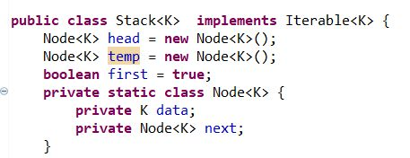

我们希望Stack是可以适用多种数据类型的，比如存储字符串，整数之类的，于是我们在类名称后面加了<K>，这是java里面的基础知识，凡是在类名称后加上<X>(x指代任何数据类型)，我们就成为Generic Class。它是专为这种情况设计的，所谓K只是一个形式参数，到时候如果我们想创建了个存储String 类型的Stack 那就这样声明：

Stack<String> stack = new Stack<String>();

明白了吗？<K>只是一个类的形式参数，等我们创建实例的时候，要顺便声明K具体等于什么，等于Integer的话，你创建的是存储整数的Stack, 声明BufferedImage 的话，你创建的是用来存储图片的Stack !

我们继承了一个Interface: Iterable, 继承了这个Interface的类就可以像在Python里面那样，使用For-each语句，就像这样：

```
for(int x: stack){
...
}
```

然后程序就会自动遍历stack内部的所有元素，用不着你亲自去写计数器等东西！

好，我们继续。

Push() ：

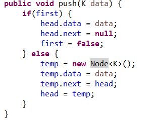

如果你理解了上节课的东西，那这个很好理解，不解释。

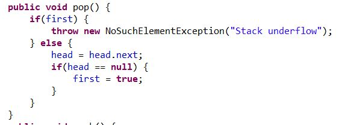

说白了就是删去表头，表头是LinkedList里面最容易删除的元素。

所以我们看到，当我们调用Push（）方法时，我们增加了一个元素，让它成为新的表头，当我们调用Pop() 方法时，我们删除了当前的表头，这不就是堆(Stack)吗？

当然，你也可以这样做：

把新的元素放到表尾，删除元素时删表尾的元素。

但是我们不会这样做，因为我说过，对于LinkedList，增删表头永远是最容易的，时间复杂度是常数O(1) !因为省去了按照地址寻找表尾的过程，如果对表尾增删的话，时间复杂度是O(n), 因为每次从上一个元素找到下一个元素花费的时间是O（1），要寻找n次，当然就是O(n)。

Peek()：

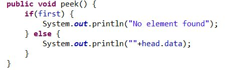

查看最近添加的元素，用Peek() 方法。

为了检验我们的Stack 是否按照我们想要的方式储存数据，我们可以添加一个PrintAll（）方法，将所有元素打印出来，当确认无问题后，可以把这个方法删掉，因为它不是必需的。

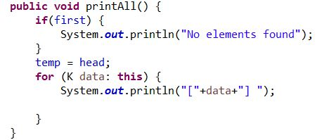

因为我们implement了一个Iterable，所以我们必须添加这个方法：

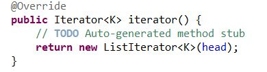

接下来我们要做一个ListIterator(非必听内容):

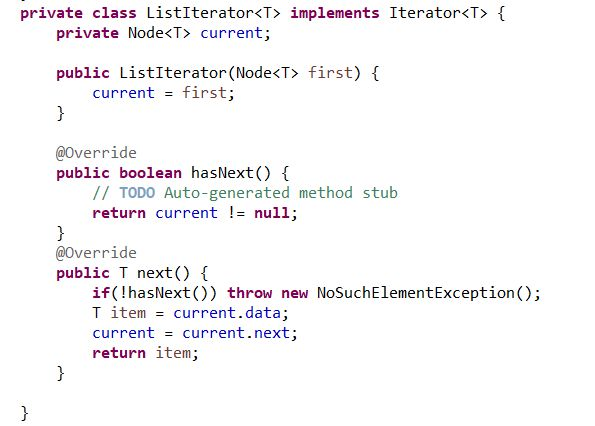

它继承了Iterator, 然后我们让它的next方法里做一个传递功能，从当前的元素传递到下一个元素，再让hasNext（）方法检验当前元素是否为空，这个类有一个Construtor, 赋予了current的值，我们给它赋予表头，接下来我们的Stack 就可以使用For-each 语句了。

（这个听不懂没关系, 因为它不是这节教程的内容, 不熟悉Iterable 和 Iterator 的同学可以选择用传统的For语句，或是去java官方文档查看相关信息）

好，在我们的main 方法里执行一些语句，看看是否符合预期：

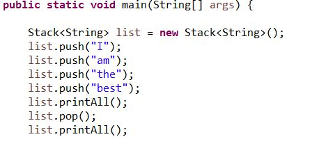

我们将堆赋予了String类型，那么list 就变成了一个储存String 的堆了！

接下来我们往堆里放了四个元素，然后全部打印，后进去的在先，应该显示的是：

best the am I

扔掉最近的元素，就是best后，应该显示：

the am I

检验一下，点击运行：

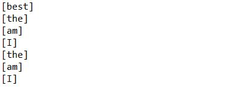

符合预期。

下一个：Queue的实现：

我们希望Queue用这些方法：

1. 增加新元素到表尾（enqueue）。
2. 移除表头的元素（dequeue）。
3. 查看表头的元素。（peek）
4. 查看所有元素（用于检验)。（printAll)

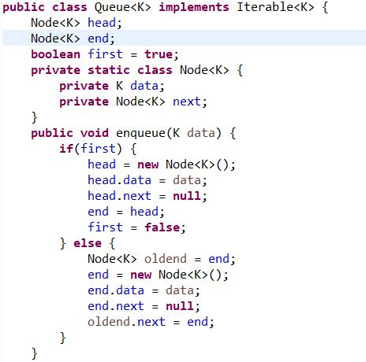

相关内容不再重复，只说一点，就是我们的Queue要同时保有表头和表尾的数据，或者更准确点，指针，这样不管是往表尾添加元素还是删除表头都变得很容易，时间复杂度也都是O(1) 。

所以我们在else 语句后，事实上是先创建一个“老表尾”，然后创建一个新的Node，让Node的data等于输入进来的参数，然后让它指向null，再让老表尾 oldend 指向

end 就可以了，和我们在表头插入很像。

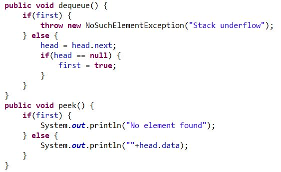

自行理解。

剩下的内容和Stack一样，不再重复，接下来做检验：

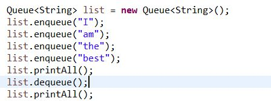

想象一下排队的过程：

I

I am

I am the

I am the best

I am the

所以打印的内容应该是：

I am the best

am the best

检验：

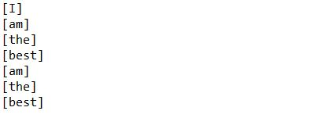

符合预期。

今天的课程就到这里，建议大家一定要在自己的编译器上用自己的思路完整实现一遍，仅仅看教程是不够的，另外附源码链接，供大家参考：

[源码](https://pan.baidu.com/s/1AKcS9AvsydICgCXWcOaITA)
​