仔细想想，在日常生活中，你见过这样的情景吗？

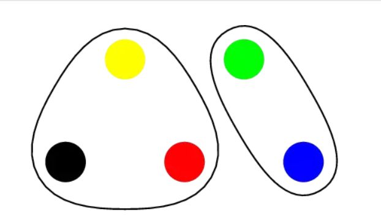

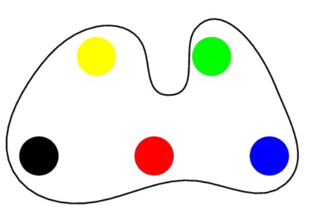

当外面正在下雨的时候，坐在汽车里的你一定见过粘在车门玻璃上的水滴，它们会由于重力的原因而向下移动，在不断的移动过程中，有的水滴会和其他水滴相碰，然后凝聚成一个水滴；在社会中，你一定见过公司或部门的合并，每个公司的职员都属于自己的集体，如果两个公司合并，那么原先属于不同公司的职员，现在就属于一个集体内了；

再看个例子：

把它想象成一块有空洞的石头，黑色的地方表示实心，白色的地方表示空心，如果你要判断从石头上方流入的水是否能从底部渗出，你需要做什么？

这个问题和迷宫问题很想，我们发现那些相邻的空洞可以组成一个更大的空洞，是不是和水滴合并很像？相邻的自动合并为一个集合？我们将所有相邻的空洞都合并成一个集合，对于上图来讲，应该最后有三个集合：

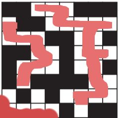

三个区域分别涂上了颜色，也就是说，只要至少存在一个集合，最高的地方是第一行，最低的地方是底下那行，那么，这块石头就能渗水。

所以：

具有将小集合或元素合并成更大集合，并检查两元素是否在同一集合内的数据结构，我们称之为：Union Find(并查集)。

为了实现并查集，我们有两个思路：

1. 归类式。
2. 连线式。

## 归类式：

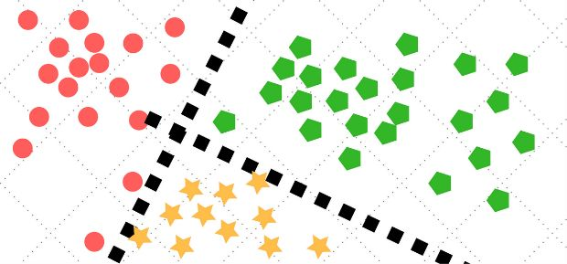

先前这些彩色块是混在一起的，我们为了让他们属于自己的集合，进行了严格的区分，比如，我规定左边的粉色区域是集合一，右边的绿色区域是集合2等。

好，假如我现在有三个集合：

{0，5，6}，{1，2，7}，{3，4，8，9}

那么每一个元素都需要附带一个“id”来指代它属于哪个集合，那么我们声明一个长度为10的整数数组，然后用数组的指数来指代元素，数组的值指代它的id，比如：

Int[] id = new int[10];

id[0] = 0; //元素‘0’属于集合‘0’：{0，5，6}。

id[2] = 1;//元素‘2’属于集合‘1’：{1，2，7}。

这样的优点是，判断两元素是否属于同一集合很容易，耗费的时间是常数O(1)。

缺点是，进行集合合并的时候，很麻烦，要进行仔细的整理。

**合并慢，寻找快。**

## 连线式：

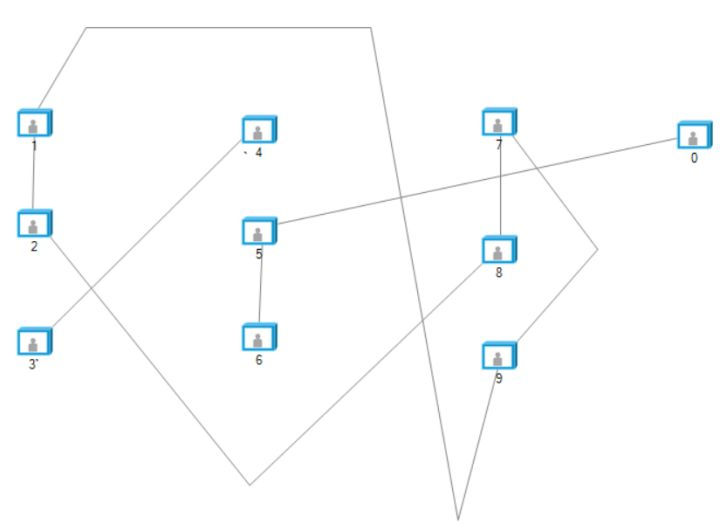

就像这样，每个标号代表一个人，被两条线连起来的人就属于一个集体了，那么仔细看会发现有三个集合：

{1，2，8，7，9} {3，4} {5，6，0}

对于这种方法，集合之间的合并是非常容易的，若是7和9相爱了，牵手成功，那么7与9所在的集合就会自动融合成一个更大的集合，就像双方的朋友圈，因为两个人的认识而从相互孤立变为融为一体。

也就是每个人除了储存自身的值，还要储存他/她所指向的那个人，类似于链表，假如张三指向了李四，那么就可以顺着张三找到李四，所以这种方法真实的结构是这样子：

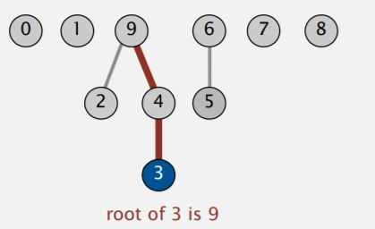

我们看到，2，4，3，9是属于一个集合，但是怎样才能判断2和3是属于同一个集合呢？原则上你必须顺着关系链条一直往上走，直到走到最顶部，也就是**根（root）为止**！

**根（root）的特点是指向null，也就是无指向**。

如果我要把{2，4，3，9}与{5，6}合并，那么我只需要将9指向5，或将6指向2就好了！并不需要像分类法那样，大动干戈，更改每个集合内元素的id信息。

但问题在于：

搞清楚自己究竟和谁在一个集体是比较麻烦的事情，需要顺着关系链一直上溯，直到找到Root为止。

所以它的特点是：

**合并快，寻找慢。**

# Java实现：

好，我们现在尝试用Java去实现Union Find，先从分类式走起。

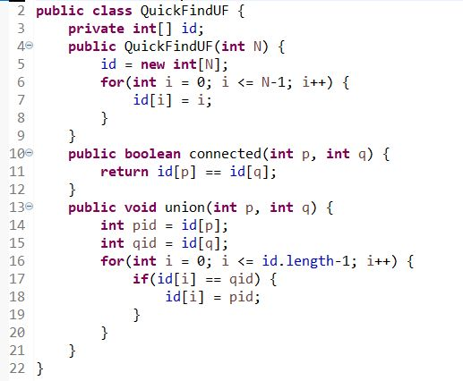

因为分类式是快速寻找，所以我们起名为：QuickFindUF（UF指代UnionFind）。

我们先声明了一个整数数组，按照刚才讲的，它是用来储存id的，id相同的元素处在一个集合内。

4-9行：这是一个Constructor（构造器），这是面向对象编程的重要概念，简单地说，它的作用是：当创建一个实例的时候，顺便能往进输入几个参数。

比如：

`Class 汽车 {`
`Public 汽车（颜色，价格，性能）{`
`….`
`}`
`….`
`}`

创建了一个汽车类后，我创造一个真实的汽车：

`汽车 奇瑞 = new 汽车（红色，50000RMB，差）`；

就是这个意思，懂了吧？

好，这个Constructor需要一个整数，作为我们数组的长度，也就是元素的数量，然后先给每个数字赋予一个只属于自己的id，就等于它们自己就好了，这时每个元素都是独立的。

13-21行：Union() 方法，用来合并集合。

假如我们现在4号元素和5号元素接触了，那么我们需要筛选出id与4号元素相等的元素，也就是4号的盟友，统一将它们的ID更改成5号的id（当然你可以反过来）。

10-12行：判断两元素的id是否相等，如果相等，返回True, 表示属于同一集合。

好，简单的检验一下：

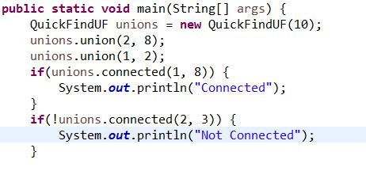

期待输出结果：

Connected

Not Connected

输出：

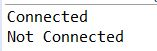

符合预期。

好，下一个：

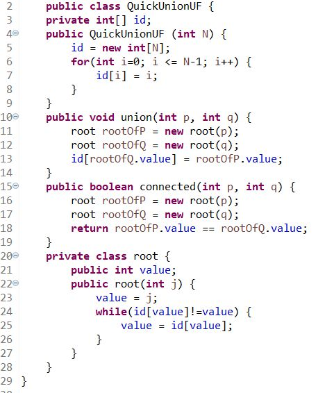

起名为QuickUnion，表示合并迅速，由于每个元素的id都储存着它指向的那个元素，所以在初始化的时候，我们让每个元素都等于它自己，这与上一个方法的代码一样，但含义不同。

20-29：一个root类，我们用它来获得某个元素的root，在该类内有一个construtor, 它获得输入的元素，然后不断地判断元素的id是否等于它自身，如果等于，那它就是root！如果不是，那就让value等于当前value所指向的下一个元素。

15-19：比较两元素的根元素是否相等，如果相等，那么它们是属于一类的。

10-14：我们让其中一个元素的根指向另一个元素的根，这样就成功合并，比起分类法，它的union方法是不是很简单？

好，做个实验：

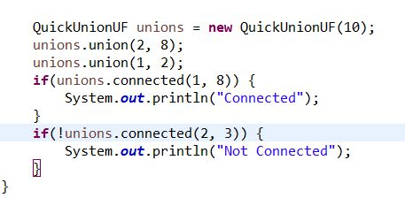

输出：

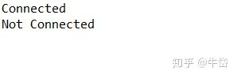

OK。

两方法在时间耗费上做一个比较：
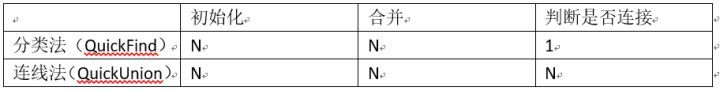

要注意，这里面的N是按最坏的情况算的，所以虽然连线法的合并也是N，但是在大多数情况下，会比N小很多.

这节课先到这里, 大家再见.